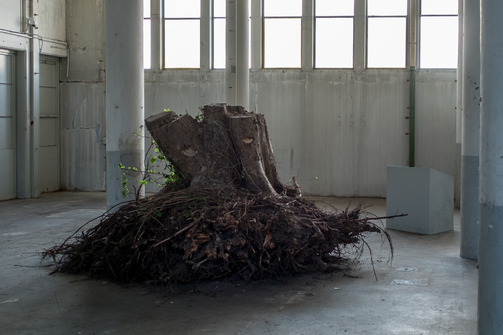
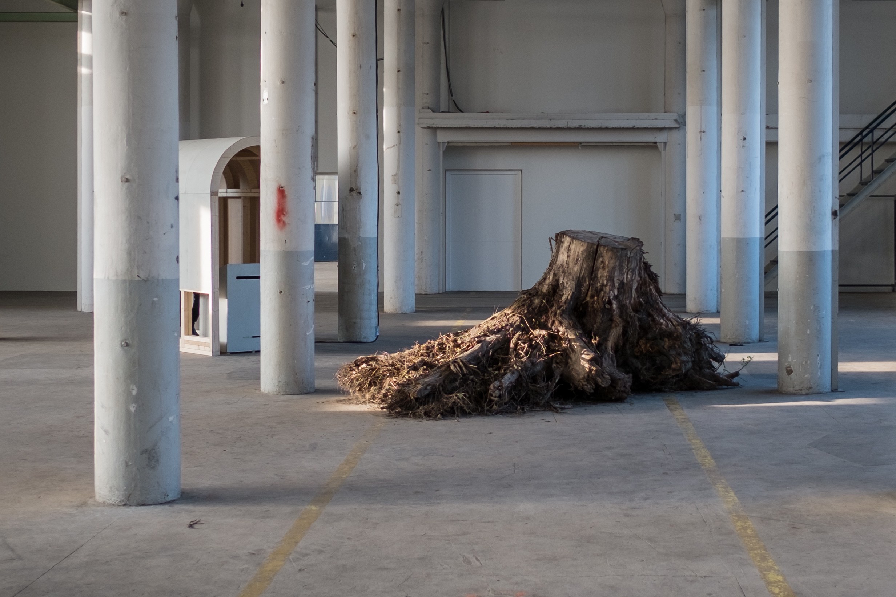

Over the last 16 years, the soil of the Shock Forest has been overturned in the search for buried ammunition, traces of cyanide, and other weapons or toxins. The two trees in view, which originally had ‘monument status’ were the last to be cut down after unexploded munitions were found in the soil under their roots. They will soon be replaced by two trees of the exact same species which will in turn gain monumental status. What are the new trees a monument to? What are these old, discarded trees now that they are no longer protected by our legal status? What were they monuments to in the first place? If these trees tell a story about our shared pasts, what might they say about our shared futures?

