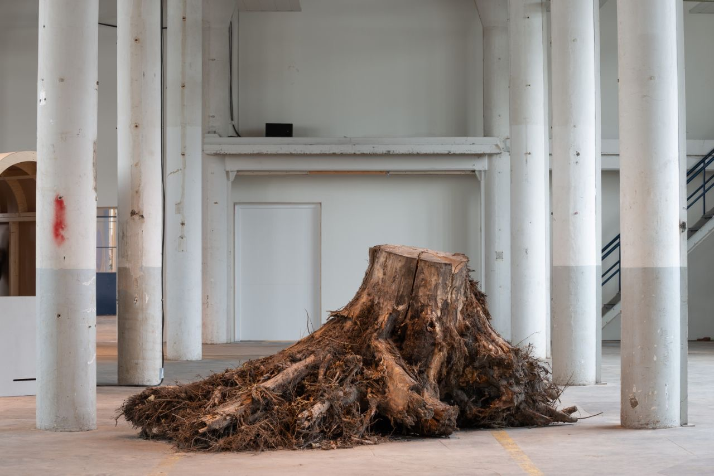

During a 4-month long residency at het Hem gallery in Zaandam, we researched the history of Hembrug ex-military terrain and its Shockbos (Shock Forest) through a process of open research and collective experimentation. Our relationship with the Forest became central to our process. During our residency, we visited the forest several times, trying to connect to the stories that are still kept among its ruins. The two tree trunks you can see in the grassy patch outside the café are the last two trees of this forest.

Over the last 16 years, the soil of the Shock Forest has been overturned in the search for buried ammunition, traces of cyanide, and other weapons or toxins. The two trees in view, which originally had ‘monument status’ were the last to be cut down after unexploded munitions were found in the soil under their roots. They were replaced by two trees of the exact same species which in turn gained a monumental status. What are the new trees a monument to? What are these old, discarded trees now that they are no longer protected by our legal status? What were they monuments to in the first place? If these trees tell a story about our shared pasts, what might they say about our shared futures?

•••

The Schokbos (Shock Forest) was planted in 1902 in the military terrain of Hembrug. It was mapped out according to a detailed planting scheme with the aim of testing projectiles, grenades and bombs produced in the neighbouring ammunition factory, Artillerie Inrichtingen (later Eurometaal). These weapons were shipped to bloody conflicts around the world in Israel, Turkey, Iran, Guatemala, Mozambique, South Africa during apartheid and dozens more. The Shock Forest acted as a protective shield for the factory in case of explosions and created a sonic and visual camouflage to its activities. During the most active years of the factory, workers were often sent to the forest to dispose of highly toxic materials. Unexploded bombs and other testing equipment were left buried under the clay soil after the closure of the factory in 2001, when the military terrain was abandoned.

In 2006, the Shock Forest was officially declared a regional and national monument, together with the factory buildings of the Hembrug terrain. The totality of the former testing ground will soon be accessible to the public, once the decontamination of the forest is complete.

On the very first day of residency, we went inside the prohibited areas of the forest, and after some time spent carefully walking among old bunkers, contaminated trees and wild vegetation, we met a group of workers that were uprooting trees from the ground. One of them, Jack, explained us that they were removing the trees to clear the soil underneath and decontaminate the earth. In total, more than 700 trees were about to be uprooted. The historical monument-trees who were witnesses to military violence would be replaced by new, uncontaminated trees.

The official document that assigns monument status to the forest caught our attention. Namely we learned that not all the vegetation of the Shock Forest was given monument status, only the vegetation that was in proximity to the military buildings or that which had a specific context behind it:

«The original planting of 1902 was based on a planting scheme that can still be recognized in some places: the forest near the B cluster and the avenue to the east of the former M buildings. The greenery that spontaneously developed further afterwards is not valuable from a cultural-historical point of view because there is no concept behind it. In the system of this designation it has been decided to designate that planting that is not only specially laid out, but that is also located in or near a cluster of buildings to be designated. Buildings and plants reinforce each other in those places. That is why only the planting at cluster B and the Zaandam Sector Park has been designated as a national monument».

More than a month after our first visit, we went back to the forest to check on the trees. Jack was there again and showed us a mount of uprooted tree-trunks. The trees, torn out of their ecosystem, formed a mount of sundered roots, stretching in all directions. They had ceased to be monuments in the very moment of uprooting and quickly turned into disposable material.

While looking at the mount of uprooted trees, we thought that something needed to be done about them in order to preserve the violent memories they withheld. They were some of the last witnesses of the activities of the Shock Forest, a forest planted to be bombed, planted here to bomb there, elsewhere, out of sight.

We asked Jack if we could keep the tree trunks and he agreed to give us the last two that had been cut, a poplar tree born in 1940 and a maple tree born in 1983. On the following day, we moved them to the front of the het Hem building entrance, their silent presences greeting anyone entering the building.

We started posing questions about the different shifts of status these trees had undergone. They had first been planted to hide military activity, and then been deemed monuments for the very military activity they had hidden from view in the first place. Now they had lost this monumental status but could gain another status shift as ‘art objects’ inside the (still monumental) art institution if we decided to bring them inside. What would it mean to put an ex-monument of war inside a monument of war? We thought their presence inside could become a subject of conversation. Two discarded trees could be transformed into a forum for questions around monumentality, heritage and our current responsibilities in regards to past colonial violences.

We remained skeptical about the tree trunks’ transformation into ‘art’ but we decided to bring them into the building nonetheless and arranged a transportation company to pull them into the main exhibition space of the institution. The moving became an improvised choreography, between the massive trees, the industrial moving machines, and us running around shouting instructions above the loud noises of the motors. We placed the trunks among the white columns, with their roots directly on the concrete ground.

In the week preceding our exhibition ‘No Camouflage’ which took over most of the building and showed our research process of the preceding three months, we started noticing how fast the trees had adapted to their new environment; new leaves were starting to grow from the trees´ roots due to the mild climate of the space and spider webs connected the trees to the tall white columns that divide the space.

Because our exhibition was only on view until mid-December, we drafted an official request to the city of Zaandam to instate the two uprooted tree trunks back into the forest as monuments once again, not in honour of the military heritage of the area, but as monuments to the victims of the violence that was produced in this terrain. Both the developers and the city council reacted positively to our request, and the next question was the ‘exact’ location in the forest they would be placed in.

After a conversation with Bas and Judith from Bind, with which we had collaborated with during the course of our residency, we found an ideal place for the trees in the grassy area around their café-community center. We felt that the trees would connect perfectly with the welcoming surrounding they had already built there, were kids played, bread was baked and people gathered to enjoy the small strip of nature they took such beautiful care of. In this way, the trees could both be reminders of the past and active parts of a living future.

On our last day together, we loaded the two trees on a moving platform, and played music to accompany them in their final transition back to the forest. We banged on pots, pans, shakers, and other kitchen equipment and jumped on the moving platform alongside the big trunks. The truck moved us all throughout the ex-military terrain towards Bind. It was a solemn march, more solemn than we thought it would be. When we arrived in the area where they would be left, they were first suspended in the air and risen up 50 meters so as to get over some other trees that were in the way. From there, the trees could see the entire land which was their home for 80 years.

Now if you look again at the grassy patch next to the café, you can see the two trunks in all their complexity. These trees heard the sounds many have heard as their last. They are sonic and physical witnesses to the violences suffered by thousands because of the equipment manufactured in this terrain. Furthermore, they share the plight of the exiled, since they also have been exiled from their former homes, echoing the fate of the uprooted, from Palestine, to South Africa, to Angola and Indonesia.

And yet, against all odds, these trees are now the sources of new life, helping a new ecosystem of care and play flourish. These trees now create new livelihoods which we hope will heal the echoes of the violence of this terrain.

Thank you Judith and Bas for your kind welcoming of the trees. They couldn’t have found a better home.

