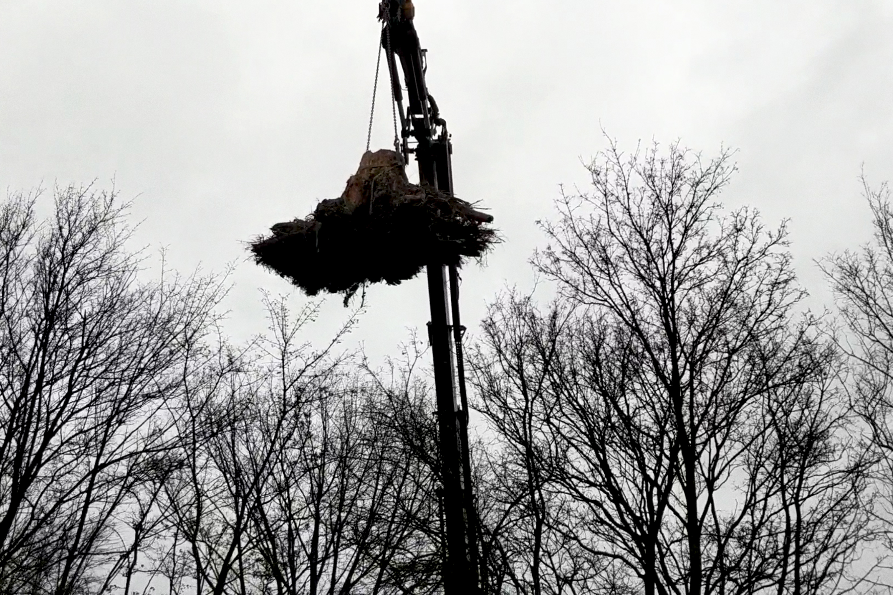

An essay by Shock Forest Group entitled "This Forest Was Built To Be Bombed", is featured on a new digital exhibition and research project curated by Xenia Benivolski for e-flux entitled "[You Can’t Trust Music](https://yctm.e-flux.com/sonic-boom)".

