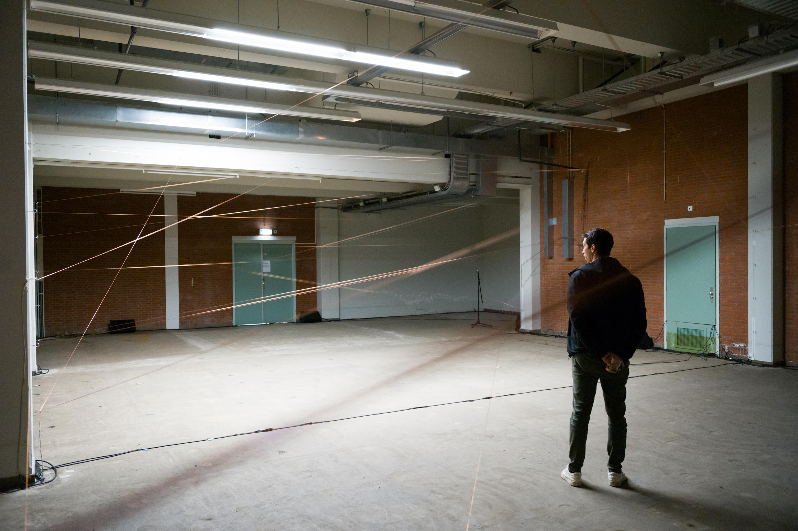
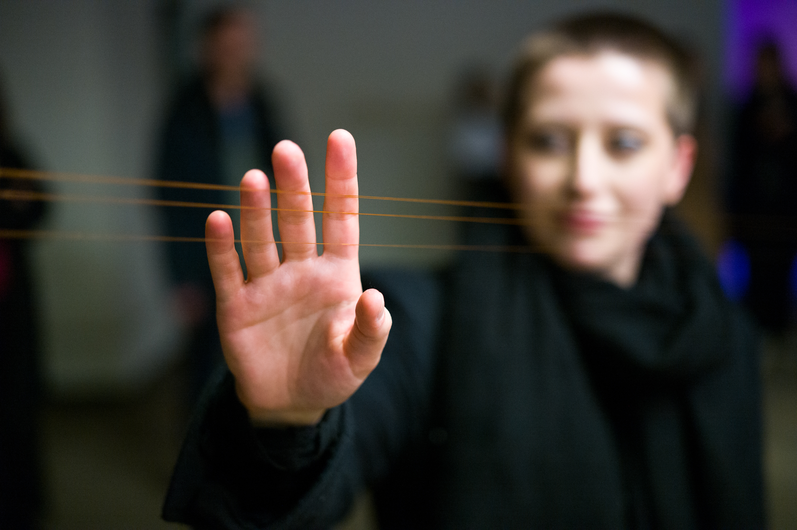

Very low frequency waves can travel around the world and pass through solid objects including concrete buildings. Each copper structure in this space is an antenna, capturing different sounds depending on the size, shape, and direction of its area.

We first started experimenting with a small antenna in the backyard of our temporary home in Eindhoven. Since April 1, we have been in residence searching for traces of social, colonial, and natural histories in the development of radio. In this first phase of our research, we have more questions than answers.

Our bodies help us listen to these questions. Where are the sounds in this room coming from? How will they change day to day? How do non-human beings feel the noise our electrical grids create? How does the sound affect us even when we can’t hear it? We will continue to layer antennas in this space throughout the STRP Festival to reveal new sounds that may both situate us in Eindhoven and shift our perspectives to global phenomena that emit frequencies we might hear in this room.

