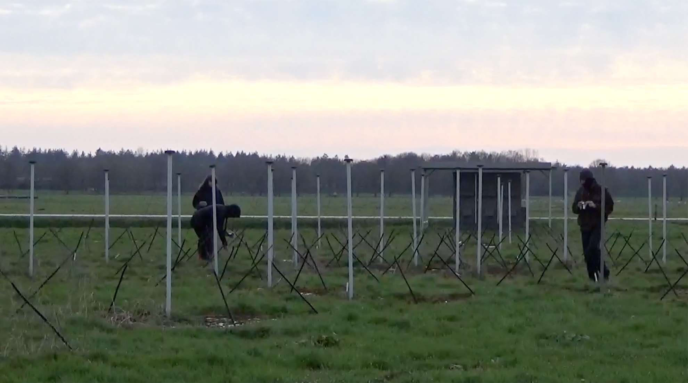

When we set out to learn about cosmic radio, we started with the Phillips company’s early production of radios and its shortwave radio broadcasting station called PHOHI for Dutch citizens living in occupied Indonesia. The first radio broadcasts from the Netherlands to the so-called Dutch East Indies were sent via longwave from Radio Kootwijk, the first site we visited on April 4. When we arrived, we heard guns firing from a military base nearby.

Like a call and response, humans send and receive, hoping to be heard or found. The LOFAR Telescope Core, the second site we explored that day, looks like an unassuming array of panels and antenna dispersed in a field near Exloo, but underground fiber optic cables connect it to 51 other sites across Europe. The telescope operates at the lowest observable frequencies from Earth. There is no fence around the telescope core and birds pass through to graze while moss grows on the antennae.

Our third site, the Westerbork Synthesis Radio Telescope, is an array of 14 telescopes designed for large scale surveys of the northern sky, located at the site of the former Westerbork Nazi detention camp, which later became a refugee camp operated by the Dutch government. Humans have always yearned to create new forms of intelligence, but when we use our bodies to understand our surroundings, we may find terrestrial intelligence that lives around us.

When Philips sent the first PHOHI broadcasts from the Philips Laboratories in Eindhoven, Philips’ shortwave transmitters became a national pride. In 2004, Huizen’s city council voted to commemorate the Huizen Transmitters with a scaled down replica of the original structures, now located in the center of a roundabout. We visited the transmitters before returning to Eindhoven on April 5.