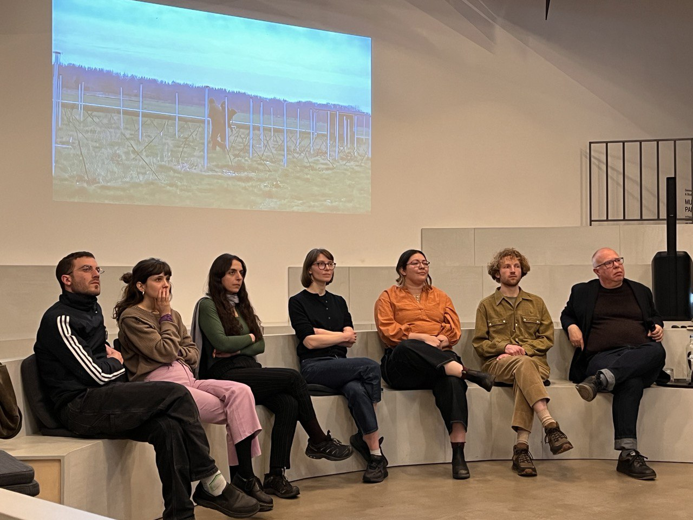

On April 12th 2023, Shock Forest Group did a [talk at Van Abbemuseum](https://vanabbemuseum.nl/nl/zien-en-doen/tentoonstellingen-activiteiten/shock-forest-group) about Cosmic Radio, hosted by Charles Esche.

Talk report, by Bas van Duren:

EINDHOVEN – A polyphony of voices that collectively gets to something collective. This article not only briefly touches upon how Shock Forest Group (SFG) presented itself last Wednesday in the Van Abbemuseum, but also the crux of the Cosmic Radio project for which SFG has settled in Eindhoven and can be experienced with a sound installation during STRP until Sunday in Microstad.

Shock Forest Group is in the Netherlands for the second time to conduct in-depth research and for Cosmic Radio it is immersing itself in radio, the medium as we know it and radio waves that can be experienced as echoes from a primeval past. In less than two weeks, the research collective has spread its wings throughout the Netherlands and with seven different backgrounds, seven different perspectives come together. In the Van Abbemuseum, the group introduced itself and museum director Charles Esche, as moderator, asked questions about SFG's research methods.

During the Talk, Shock Forest Group will show a report of three locations where its members have investigated: Radio Kootwijk, a radio telescope next to Camp Westerbork and a LOFAR (low frequency array) in Drenthe. Several surprises have emerged from those visits. The association of location with violence, for example, as mentioned by researcher Katya Abazajian. That was already there during SFG's first investigation at the former bullet factory Het Hem, now the group heard shots from the nearby military training area at Radio Kootwijk. The state of disrepair at the various locations is impressive: the built-up sediments, moss and lack of maintenance are in stark contrast to always wanting to transmit, but not being able to look at the source.

It also contains a core of what Shock Forest Group is doing. Linguist Susanna Gonzo explains how in English there is a connection between the words "sensing" and "sending" and how much is thrown into the world without questioning whether it's something we want to hear. The group is clearly interested in a renewed appreciation of being able to listen, a theme that fits in seamlessly with STRP's 'The Art of Listening', which the collective taps into. This will happen with a radio broadcast at STRP Frequencies in Microstad on Saturday, April 15 at 5 p.m., which can be listened to on the spot or via the STRP site.

The pièce de resistance is a sonic installation as part of STRP Expo, also in Microstad. For the installation, the collective spends the entire festival making antennas that pick up frequencies that we cannot hear, but are certainly there, partly due to all the electrical devices we use. The installation will be activated by Shock Forest Group on Sunday, April 16 at 1:00 PM, 3:00 PM, 5:00 PM and 7:00 PM as so-called "live interventions".

A point of discussion during the Talk is how the frequencies are translated to the visitors, who are seen by SFG as an essential part of the installation. During the Talk, music producer and SFG member Nicolas Jaar points out that these are not the most exciting tones to hear and that they could be played a bit more excitingly. Opinions on this still differ, but that makes the Shock Forest Group cool to see: six of the seven members are here and they come from both art and science backgrounds. These are collaborations that everyone can encourage.

Shock Forest Group is an international, multidisciplinary research collective consisting of Katya Abazajian, Sheryn Akiki, Axel Coumans, Susanna Gonzo, Nicolás Jaar, Daria Kiseleva and Jelger Kroes. For Cosmic Radio, the group conducts widespread research into radio and electromagnetic waves in Eindhoven. The project was initiated by Frank Veenstra (Unusual Suspects) and Powered by TINC and is organized with partners STRP, Van Abbemuseum, TAC and Nul Zes. Cosmic Radio is supported by Brabant-C, Stichting Cultuur Eindhoven, Eindhoven 247, Prins Bernhard Cultuurfonds and Fonds21.

