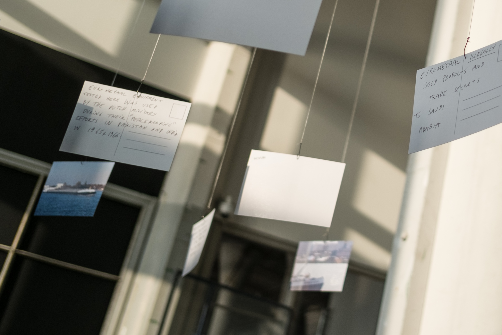
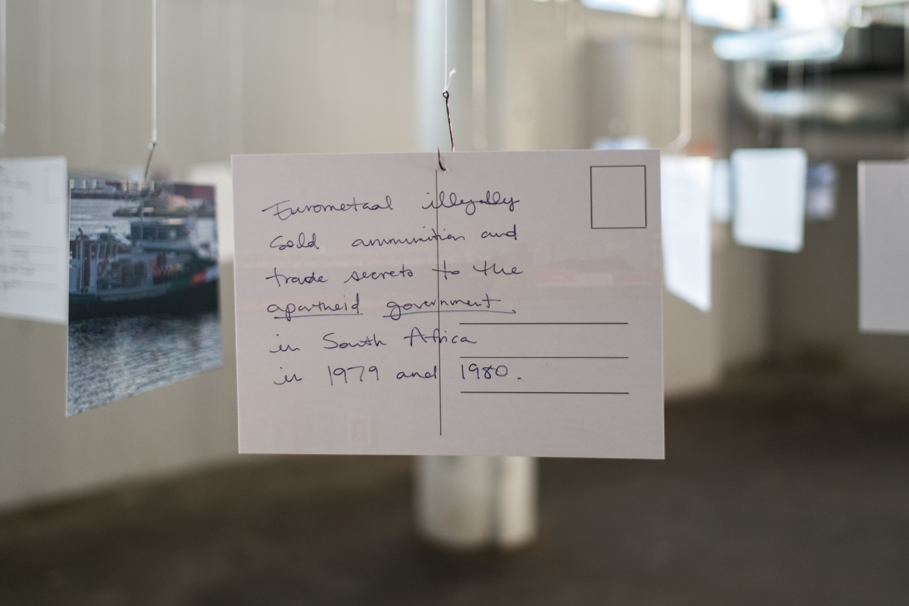
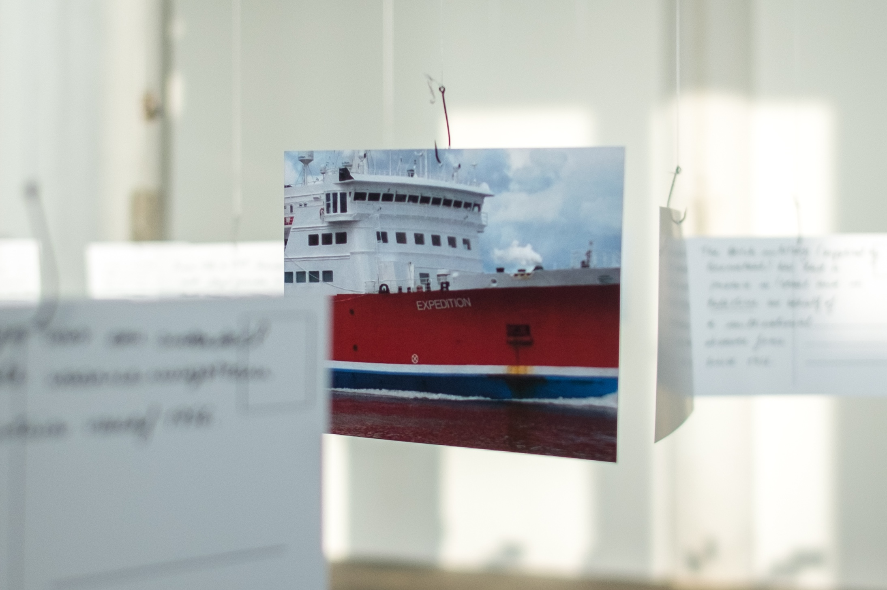
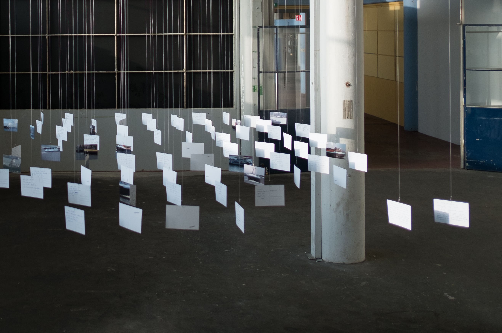

During our early days of research within this building, we noticed how light fell on the water of the Noordzeekanaal and reflected onto the ceiling of the factory, trembling with warped undulations. From the large windows of the former factory we started noticing the ships passing through. We saw how each ship carried a different name and different cargo. We began listing these names. The list turned into a collectively assembled photographic archive.

We don’t know what is hidden in the belly of these ships, but the water carries them. Where did bullets land on the other side of the water? In the past two months of investigation, we have followed the bullets to their end points. These ‘movements’ appear as messages in the back of the postcards. What is behind this movement? What’s behind these names? Expedition, Stranger, Conquest, For-Ever... The echoes from the past are still hiding. In blurring the past and present, we see the here as there and the there as here,

always here, wherever one is and wherever one looks, closest to home. Infinite responsibility therefore, no rest allowed for any form of good conscience. (Derrida, Dedication to Chris Hani, Specters of Marx)

From all parts of the world Zaan-industries obtain their raw materials and their products are to be found all over the world. The all-connecting element is water. The prosperity of the Zaan-area will continue to grow so long as industry, trade, and shipping are prepared to see each other as the equally strong links of a solid chain. (Artillerie Inrichtingen sales pamphlet, ca. 1965)

