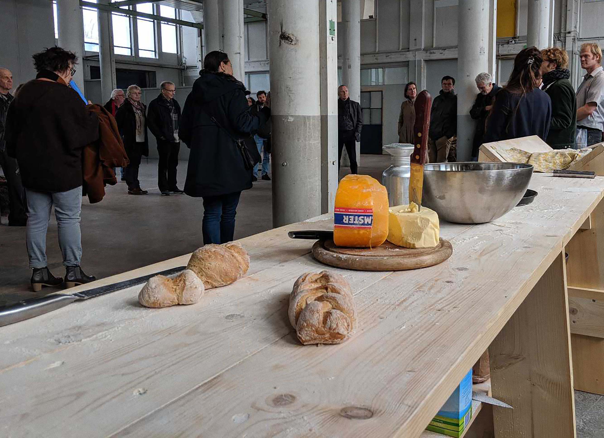

During our time at Het Hem, we organised a communal meeting inviting local residents and bread makers. Our aim for the gathering was to provide a space in which we could all feel comfortable, in which we can all feel free to talk, free to move. As the smell of bread pervades the space, challenges its borders, a universal language may speak to us about home, hospitality and generosity. We thought that the event was not only about bread and did not end at that moment. We saw bread as a catalyst to bring people together. How we can create a common space as a seed for future events and collaborations. The question we hoped to start with in today’s conversation was: What does it mean for this place to be a home for culture?

Bread is made of visible and invisible fragments. Not only flour and water, but also smells, temperatures, memories, atmospheres. Bread can be a place in which we meet with others. By making bread together, looking at each other, we exchange stories, ideas, energies. By kneading our stories together, we are endowed with a new, collective responsibility. The process of making and eating bread is a process of healing: by chewing we process history and traumas. By sharing this space, eating this food, we get involved into a collective effort to digest history. A collective digestion of the past means internalisation and understanding rather than forgetfulness.

•••

The word bread comes from Old English and means fragment, bit, crumb. It also means to extend, to spread, to stretch out. To rise and grow. As when people come together and act collectively, the coming together of flour and water particles creates something that is much more than the sum of its parts.

In Romance languages the word for bread (pane, pan, pain) comes from the latin word panem. Panem bears the root pa, which means to nourish. Pa also means to protect, to sustain, and it is the same root of the word pater, father. The etymology of bread seems to speak to us about origin and growth in the warmth of a familiar, safe environment.

The word company comes from latin cum-panis, which means with-bread. Bread underlies the idea of togetherness, of solidarity. The word compassion also carries the root pa. Compassion literally means to suffer-with. It means to be deeply aware of the suffering of another. This place, as you might know, is a former ammunition factory. The products made here were sold all around the world to sustain conflicts, to oppress people, to hinder revolutions. Even though we might not readily see the traces of the suffering this place caused elsewhere, it does not mean such violence did not take place. During our months spent here researching about the history of this terrain, we have often faced questions on how to enact a process of collective recognition, how to create empathy towards both the visible and the invisible, the here and the elsewhere.

The abundance or scarcity of bread has always been a parameter to measure the wellbeing of a country. During war times, bread has often been rationed. The possibility of buying flour or bread often becoming the greatest difficulty for the population. It seems that the circulation of bread is inversely proportional to the circulation of weapons. The relationship between bread and war is the one between life and death. Between togetherness and division. Between bounty and deprivation.

Both war and bread are related to the term safety. What does it mean to be safe? We have asked ourselves this question a lot in the past months. Protected under the canopy of this new art institution, we have tried to acknowledge our role of privilege: it is safe to be here. Neoliberal wars are fought in the name of safety. The deployment of “defence” forces is justified by the promise of a safe national space. Safety is guaranteed through the construction of barriers. Through exclusion. Those inside are protected at the expense of those outside. Security systems installed in private homes create a shield against possible intruders. In these terms, safety is egoistic, fearful, privatised.

But bread also means safety. Another kind of safety. The safety felt inside a home where bread is being baked and its smells spread to the outside. A refuge that can be open, collective, inclusive. A safe space that invites you to come in, sit together and share a piece of bread. Which kind of safety are we creating here?

The practice of making bread is at odds with the highly mechanised production of ammunitions. Bread consumption builds communities. Weapon use can destroy them. Even though the workers that were employed in Eurometaal were able to create strong bindings among each other, the ultimate product was meant to break other communities, other bindings. The serial repetition of industrial production made the workers focus only on parts of the process, alienating them from the consequences of their labor.

Making bread collectively, as we propose today, is the opposite of this process. It involves attention and care at every stage. It reclaims presence through the physical relation between body and matter, between self and surroundings. Each piece of bread we make is a lively sculpture with which we interact and which allows us to re-discuss the limits of our interior space. Manipulating the dough shows us how we can re-shape the world through our own hands, how we can re-shape its borders. Bread is made of visible and invisible fragments. Not only flour and water, but also smells, temperatures, memories, atmospheres. Bread can be a place in which we meet with others. By making bread together, looking at each other, we exchange stories, ideas, energies. By kneading our stories together, we are endowed with a new, collective responsibility.

The process of making and eating bread is a process of healing: by chewing we process history and traumas. History and traumas enter us. They become ours. By sharing this space, eating this food, we get involved into a collective effort to digest history. It is primarily through the stomach and the body- not only the mind- that we deal with past mistakes. A collective digestion of the past means internalisation and understanding rather than forgetfulness.

Our aim for today’s gathering is to provide a space in which we can all feel comfortable, in which we can all feel free to talk, free to move. As the smell of bread pervades the space, challenges its borders, a universal language may speak to us about home, hospitality and generosity. Despite the hostility of this architecture, we are all here, together.
What we are doing here today is not only about bread and doesn’t end now. Bread can be the catalyst that reminds us how people can come together and cooperate. How we can create a common space. We hope this event is a seed for future events and collaborations. In light of this, we would like to ask the following questions: How can we use this space with respect to the past? How can we look at the future, carrying this responsibility, together? What does it mean for this place to be a home for culture?

