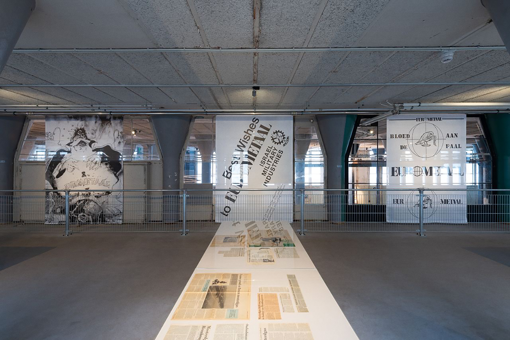
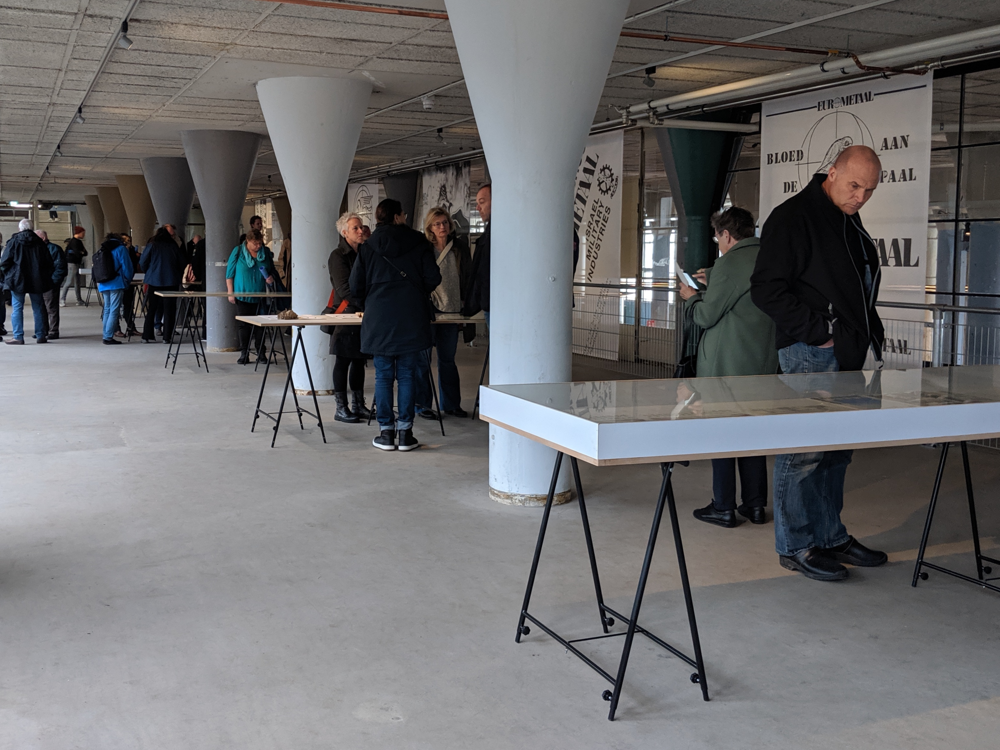

The Zaan region has always been a place for production. Industry shaped forests and waterways to maximize efficiency and profit. Industry grew from the hard labor of people who found a home in the Zaanstreek. This area, previously known as the Red Zaan, has always been a place where workers and activists united and fought for their rights. Through found documents and the Shock Forest trees’ own stories, we seek to understand the many sides of a complex history. The exhibition consisted of multiple examples of printed materials, advertisements, internal publications, booklets and memorabilia, newspapers, and other objects. The archive laid bare the historical intensity of the instruments manufactured in the factory.

This archive was compiled in collaboration with Erik Schaap and the Zaanstad Archive. Erik Schaap (1961) is a journalist and writer based in Zaandam. Beginning in the eighties, he has taken a stand against the arms industry by writing for local publications and through direct actions, with a particular focus on the Eurometaal company. 

*The products that rolled out of this factory of death varied from mustard gas to mines and from guns to grenades. Faulty material accidentally led to fatalities in the Netherlands. The merchandise that did function properly created thousands of victims worldwide...Despite the lovely appearance in 2019; you will not easily find a more guilty landscape than the terrain where you are now in the Zaan region. (Erik Schaap, Nov. 2019)*

