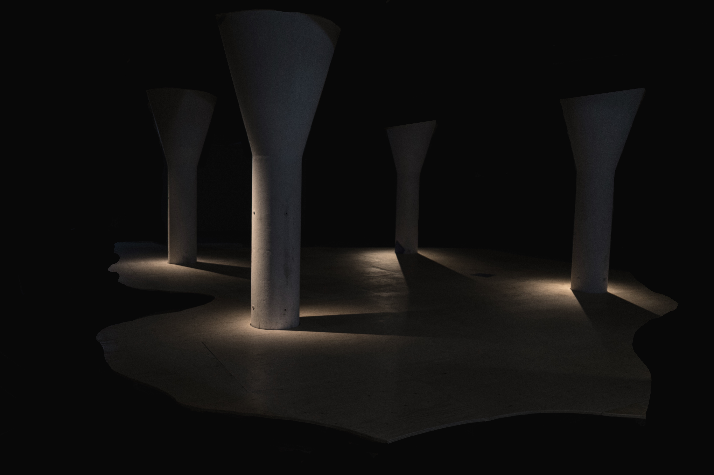

In 1902, the Shock Forest was mapped out according to a detailed planting scheme. During its functioning days, the aim was to test weapons, to program death. The logic of the function dominated the landscape, obstructing organic assemblages and natural extensions. Since the forest closed and the military moved on, neighbors have wished to walk among the trees and abandoned buildings. Children have peered over the plant-covered fences wondering what mysteries lay inside. We retraced the shape of the Shock Forest, with the intent of re-mapping it through a web of healing sounds and frequencies. This was then combined with field recordings from the forest, placed in the areas where the recordings were taken. The forest liberates itself from strict categorizations through its vibratory tranquillity, its radical presence. How can we let the forest take over our structures, erode them from within, in order to create a common ground?

