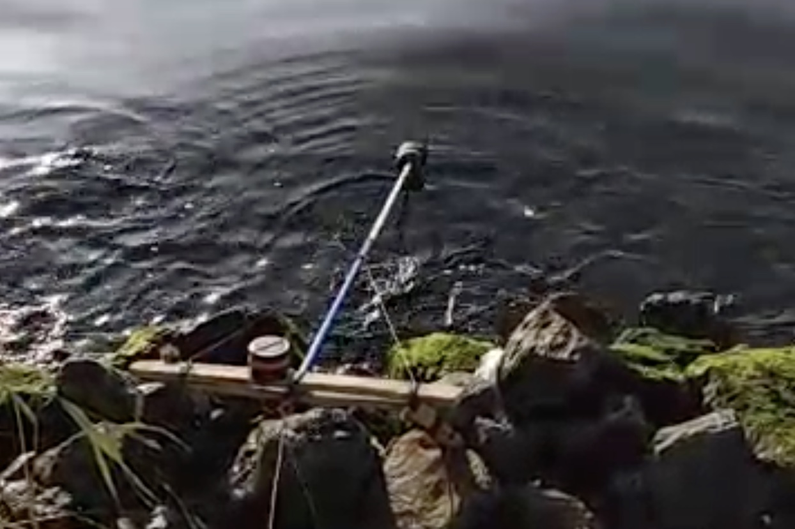
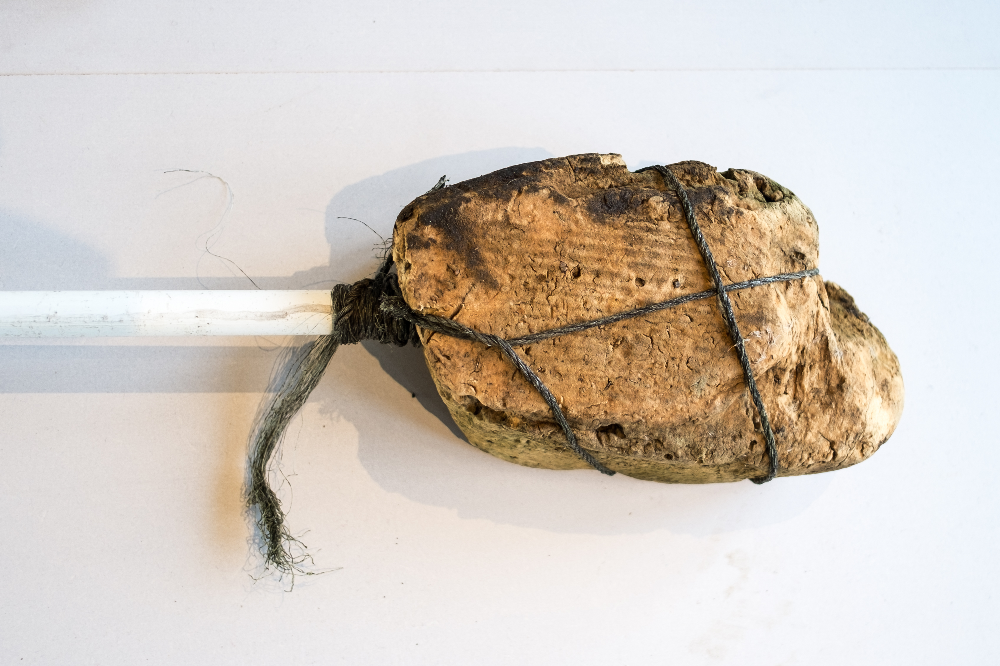

Each year Eurometaal workers celebrated the anniversary of the company’s founding on November 22, 1697 with a song. Since Eurometaal closed in 2003, the only song that remains is that of the canal’s waves, caused by the cargo ships and the continuation of overseas shipments. On the 22th of November 2019, we have set out to reclaim this day by recording a protest-song made of the movements of waves.

The waves of the Canal were caused by ships entering and leaving the harbour. They were recorded by means of a bespoke recording device that traces the waves like the needle on a LP-record. subsequently these waves were transformed to sound. The recording device was made entirely of objects found on the banks of the canal, and a gyroscope was used.

listen to the recording here

