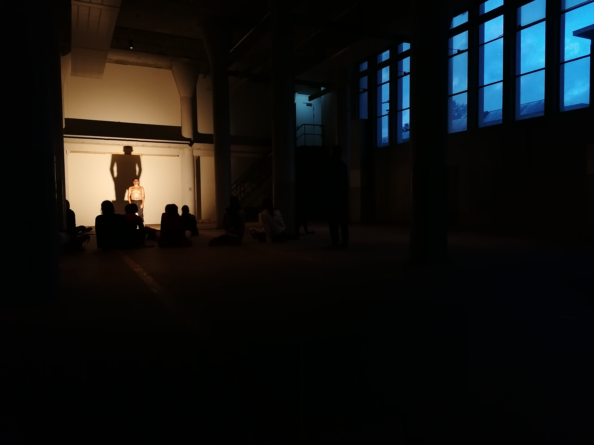

What do bodies do in an empty space?

How can we empty our bodies, to fill an empty room?

This week the artist, researcher and curator Rolando Hernández joined our group meetings in Het Hem. His work experiments with different sound practices which include listening, tuning, resonating within and without the body. Our conversations with him lead him to introduce us to the Sonic Meditations by musician, theorist and composer Pauline Oliveros (1932-2016), which strongly inspires his approach.

“Sonic Meditations are intended for group work over a long period of time with regular meetings. No special skills are necessary. Any persons who are willing to commit themselves can participate. The Ensemble to whom these meditations are dedicated has found that non-verbal meetings intensify the results of these meditations and help provide an atmosphere which is conducive to such activity. With continuous work some of the following becomes possible with Sonic Meditations: Heightened states of awareness or expanded consciousness, changes in physiology and ·psychology from known and unknown tensions to relaxations which gradually become permanent. These changes may represent a tuning of mind and body. The group may develop positive energy which can influence others who are less experienced. Members of the Group may achieve greater awareness and sensitivity to each other. Music is a welcome by-product of this activity”.

We started with a simple exercise called “teach yourself to fly”. We sat in circle on the floor of the Phase Transition Space and we first focused on listening to the rhythm of our own breathing. Then, we tried to make our breaths audible to ourselves, to the others, to the space. After, according to the instructions given by Rolando, we introduced the sound of our voices, focusing first on our own voice, then on the voices of the others, and after, on the voices of the space. In the moment of throwing out our voice, many of us encountered a certain level of resistance, an invisible barrier of insecurity and fear. Why is it so scary to play an instrument that is inside ourselves? Slowly fighting against these boundaries, we were able to hear our own voice, the voices of the others, and the voices of the space gradually increase and resonate together, becoming less and less distinguishable from one another.

After this first session, we decided to stand in the space. We started by positioning ourselves in the room. We mostly chose spots which were next to a column or next to one of the load bearing walls. We started emitting sounds not only though the vibrations of our vocal cords, but also through our interactions with the space and its components. We started clapping, smashing, scratching, thumping with our feet, hitting surfaces, throwing bricks, stones, screws. We tested resonances, fullnesses, emptinesses, echoes and barriers through the space´s responses to our bodies. We explored the sonic qualities of the room playing our body and playing the space. We were able to hear the sound of the boats penetrating the room. We were able to hear the sounds of the tunnel entering from the pipes and spreading into the space. We were able to hear the drilling sounds coming from the street. We were immersed in an assemblage of sounds coming from within and without our bodies, within and without the space.

How can we heal a space, if we first do not heal ourselves?

How can we get comfortable in a room, if we first do not get comfortable in our own bodies?

The exploration progressed and we decided to think in elevation. We climbed up to the right corner of the room and sat all together on the concrete ledge overlooking the space. From there, we began an improvisation to observe how the space reacted to different peaks, depths, lengths and sharpness we produced. We began to develop a sign and sonic language for these explorations, following the path drawn by the sound waves we were creating, observing its changing reverberations in different parts of the room. Our elevated positioning echoed the placing of choirs in churches. But unlike a church this room was not made to unify and elevate sound. It was made for the production of artillery and war instruments.

In the Phase Transition Room, we witnessed an evolution. We gradually modulated the limits of our bodies and of the space we were inhabiting. Starting from the mouth, the sound of our breathing, the voice in its multiple mutations, we ended up leaving our personal shell to tune in with the surrounding. Music needs a contextual space to be in time with. Our experiment of conversation with the space allowed us to be actively present in it, interlacing relations with it, getting to know it through intuitive processes of synchronization and resonance. We ended up perched on the ledge like pigeons, 12 voices unified in emptiness.

The sounds you can hear today walking through the Phase Transition Space are the traces of our experimentation.