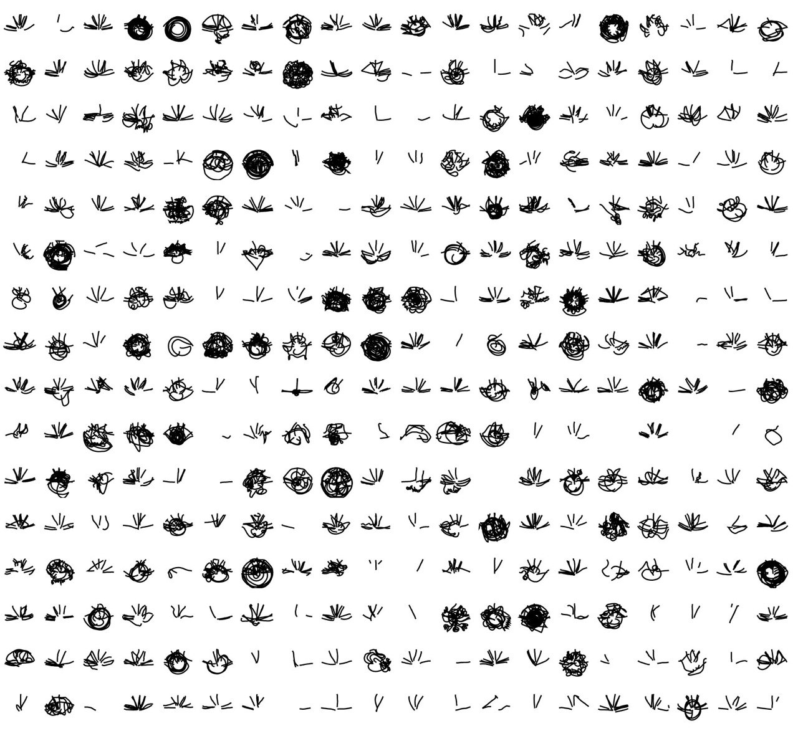

While we resided at Het Hem, area developers had just removed about 50 trees from the Shock Forest. This was part of a process to decontaminate the soil, polluted by the ammunition buried there after the closing of weapons factory EuroMetaal. We placed the trunks of two of the removed trees inside Het Hem. These trees were, quite literally, the Shock Forest. They were shocked and polluted to the extent that they had to be removed from their homes. We were told they were some of the last trees in the forest to be cut down.

An interactive display in front of one of the trees presented visitors with a series of questions. In response to visitors’ answers, the installation draws patterns of lines on the screen and affects the sounds played in the space. Changes in the sonic composition consist of direct temporary sonic responses to visitors’ answers, and of gradual changes resulting from the accumulation of visitor responses over time.\
\
A web version of The Entity can be found [here](http://shockforest.group/the-entity).

